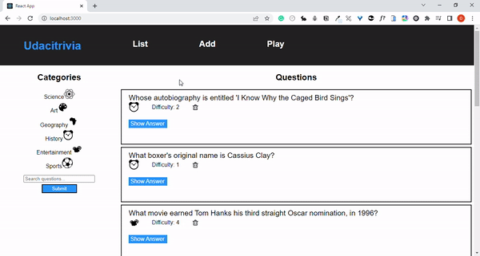

# API Development and Documentation Final Project

## Trivia App

Udacity is invested in creating bonding experiences for its employees and students. A bunch of team members got the idea to hold trivia on a regular basis and created a webpage to manage the trivia app and play the game, but their API experience is limited and still needs to be built out.

The application allows you manage questions (display, add, delete and search) and also get them by category. It also allows you to play the quiz game, randomizing either all questions or within a specific category.

The backend code adheres to the PEP 8 style guide and follows common best practices.

### Demo



## Getting Started

This project makes use of **ReactJS** and **Node** for the frontend and **Flask**, **SQLAlchemy** and **PostgreSQL** for the backend. To be able to run this project locally, all aforementioned packages/libraries must be installed first.

### Backend

#### Installation guide

- Install the latest version of python for your platform in the [python docs](https://docs.python.org/3/using/unix.html#getting-and-installing-the-latest-version-of-python)
- Working within a virtual environment is recommended whenever using Python for projects. This keeps your dependencies for each project separate and organized. Instructions for setting up a virtual enviornment when you run this platform can be found in the [python docs.](https://packaging.python.org/guides/installing-using-pip-and-virtual-environments/)
- Once you have your virtual environment setup and running, install dependencies by navigating to the `/backend` directory and running:
  `bash pip install -r requirements.txt`
  This will install all of the required packages we selected within the `requirements.txt` file.

#### Setting up the database

- Find steps to install and [get started with postgres here.](https://www.postgresqltutorial.com/install-postgresql/)
- With Postgres running, populate your trivia database using the trivia.psql file provided. From the backend folder in terminal run:
  `bash psql udacity_trivia < trivia.psql`

#### Running the server

- From within the `backend` directory after making sure you are working using your created virtual environment, run the server with the following command:
  ```
      export FLASK_APP=flaskr
      export FLASK_ENV=development
      flask run
  ```
  Setting the `FLASK_ENV` variable to `development` will detect file changes and restart the server automatically. Setting the `FLASK_APP` variable to `flaskr` directs flask to use the `flaskr` directory and the `__init__.py` file to find the application.

#### Testing

To run the tests, run:

```
    dropdb udacity_trivia_test
    createdb udacity_trivia_test
    psql udacity_trivia_test < trivia.psql
    python test_flaskr.py
```

This will populate the test database with data.

### Frontend

#### Installation guide

- This project depends on Nodejs and Node Package Manager (NPM). Before continuing, you must download and install Node (the download includes NPM) from [https://nodejs.com/en/download](https://nodejs.org/en/download/).
- This project uses NPM to manage software dependencies. NPM relies on the package.json file located in the `frontend` directory of this repository. After cloning, open your terminal and run:
  `npm install`

#### Run the frontend server

- The frontend app was built using create-react-app. In order to run the app in development mode use `npm start`. You can change the script in the `package.json` file.
- After starting the server successfully, open [http://localhost:3000](http://localhost:3000) to view it in the browser. The page will reload automatically if you make edits.

## API Reference

[View the README.md in the backend folder for the API documentation](./backend/README.md)

## Author

- Opeyimika Aremu

## Acknowledgement

- The entire Udacity team!
